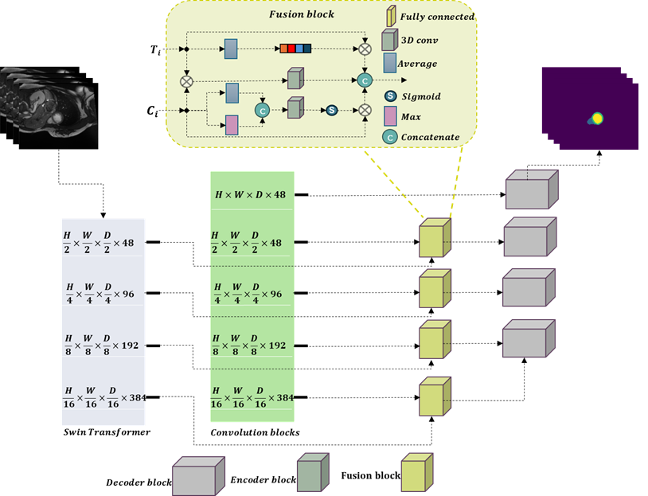

there a base repository for fundamental deep learning course. 

# Dataset
ACDC dataswt is available here: https://www.creatis.insa-lyon.fr/Challenge/acdc/databases.html

# Framework
the main acrchitecture of our study: 

# How to run the code:
We ran the code on google colab, the code is available [here](notebooks/FDL_TransConv_ACDC_96_96_12May.ipynb)
